<h1 align="center">
LAPORAN PRAKTIKUM WORKSHOP

**ADMINISTRASI JARINGAN**

</h1>
<p align="center">
“WEB EMAIL SYSTEM SERVER”
</p>

<p align="center">
    
</p>

<h4 align="center">

Disusun Oleh:

**Gede Hari Yoga Nanda  					3122500005**

**Handaru Dwiki Yuntara     				3122500017**

**Muhammad Syahrul Ramadhan				3122500030**

</h4>

<h3 align="center">

2 D3 INFORMATIKA A

DEPARTEMEN TEKNIK INFORMATIKA DAN KOMPUTER JURUSAN TEKNIK INFORMATIKA
POLITEKNIK ELEKTRONIKA NEGERI SURABAYA

2023/2024

</h3>


# INSTALASI NTP

gunakan command `sudo apt-get install systemd-timesyncd` menginstall package timesyncd

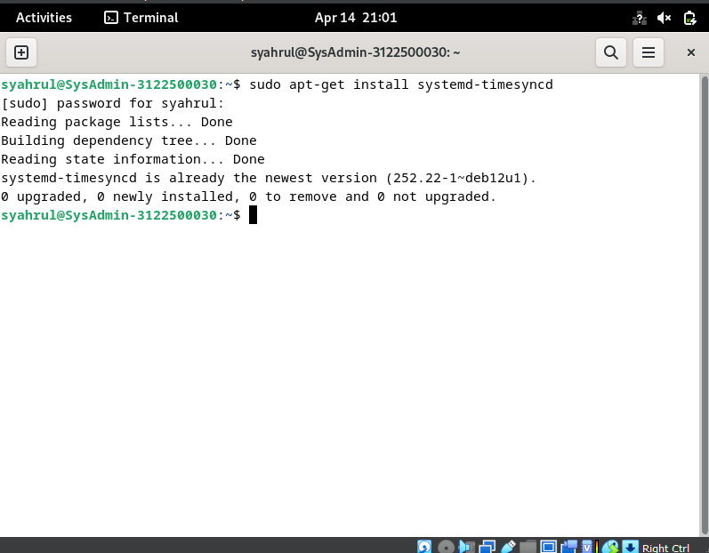


gunakan command `sudo timedatectl set-timezone Asia/Jakarta` untuk set waktu WIB (Jakarta)


gunakan command `sudo timedatectl set-ntp true` untuk menjalankan NTP pada package

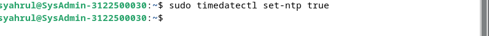

`sudo nano /etc/systemd/timesyncd.conf`uncomment ubah bagian`NTP=` 

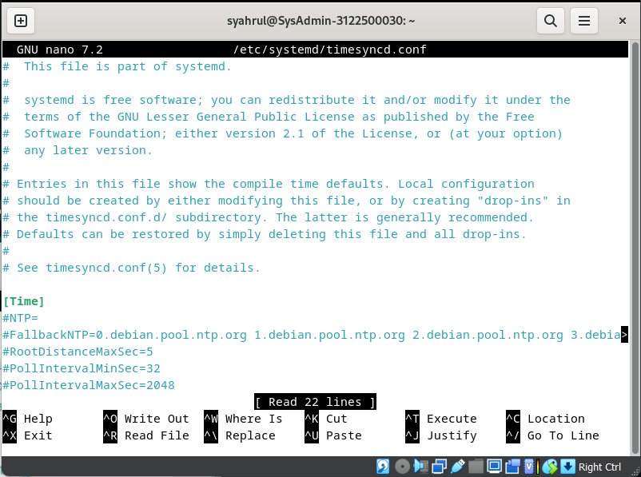

Isi bagian NTP menjadi: `NTP=0.id.pool.ntp.org `

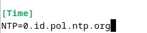

`sudo systemctl restart systemd-timesyncd` untuk merestart services karena habis di setup lalu cek status dengan command `sudo systemctl status systemd-timesyncd`

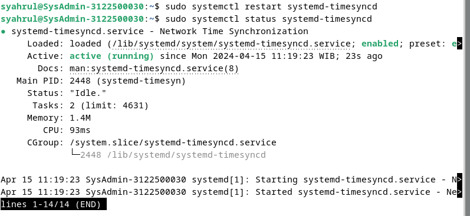

Cek apakah sudah sesuai dengan timezone WIB

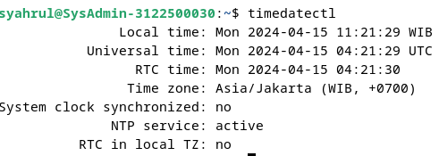


# INSTALASI WEB SERVER

Instal apache2 dengan command `sudo apt-get install apache2 -y`

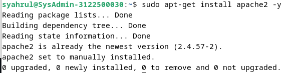

ketikan command `sudo nano /etc/apache2/conf-enabled/security.
conf` rubah pada bagian ServerTokens menjadi Prod

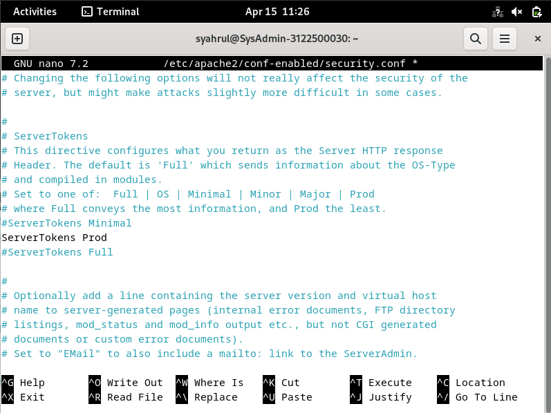

ketika command `sudo nano /etc/apache2/mods-enabled/dir.conf`
Ubah bagian DirectoryIndex menjadi index.html index.htm

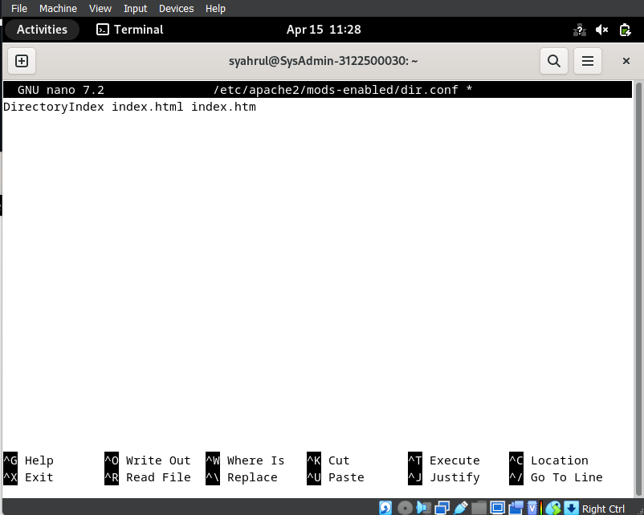


ketikan command `sudo nano /etc/apache2/apache2.conf` Tambahkan ServerName www.kelompok4.local

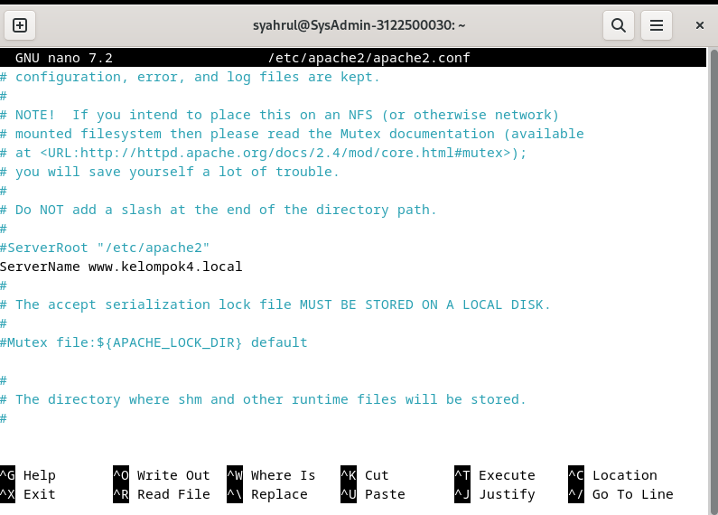

Ketikkan command `sudo nano /etc/apache2/sites-available/000-default.conf`Ubah bagian webmaster@localhost menjadi webmaster@kelompok4.local

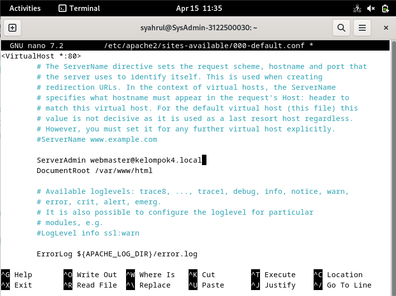

Restart services apache 2 dengan command `sudo systemctl restart apache2` lalu cek status services apache2 `sudo systemctl status apache2`

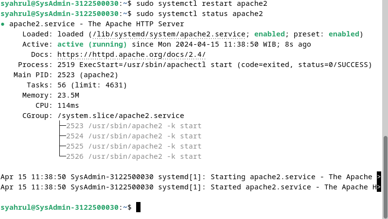

Buka browser dan ketikkan alamat `www.kelompok4.local` untuk mengecek

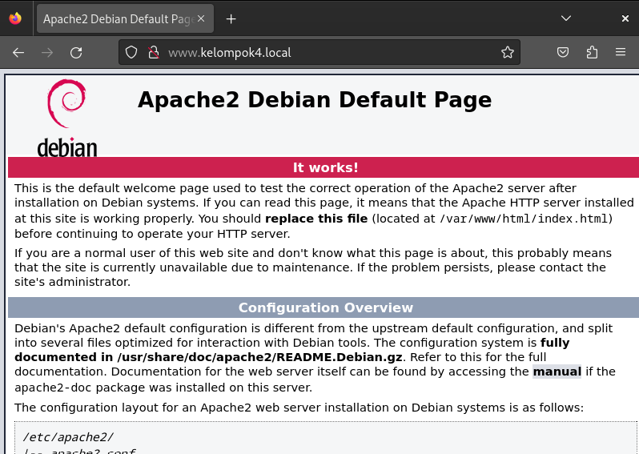

install PHP dan fungsi mbstring digunakan untuk memanipulasi string atau text non ASCII `sudo apt -y install php8.2 php8.2-mbstring php-pear` lalu cek versi dengan command `php-v`!

[webserver](img/Tugas5/webserver8.png)

buat file `php_info.php` di /var/www/html `sudo nano /var/www/html/php_info.php` isi file php_info.php dengan kode berikut `<?php phpinfo(); ?>`

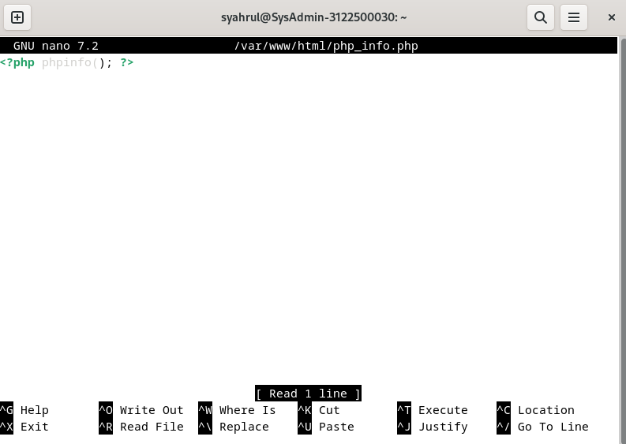

install PHP FPM 

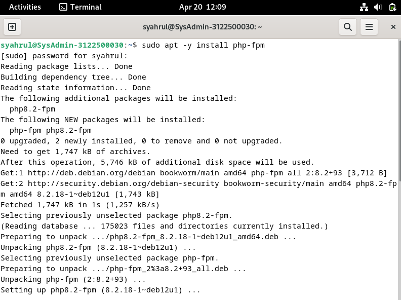

ketikan command`sudo nano /etc/apache2/sites-available/default-ssl.conf` ini berfungsi untuk mengarahkan apache2 ke php-fpm tambahkan di dalam tag `<VirtualHost *:443></VirtualHost>`
  ```
    <FilesMatch \.php$>
        SetHandler "proxy:unix:/var/run/php/php8.2-fpm.sock|fcgi://localhost/"
    </FilesMatch>    
```

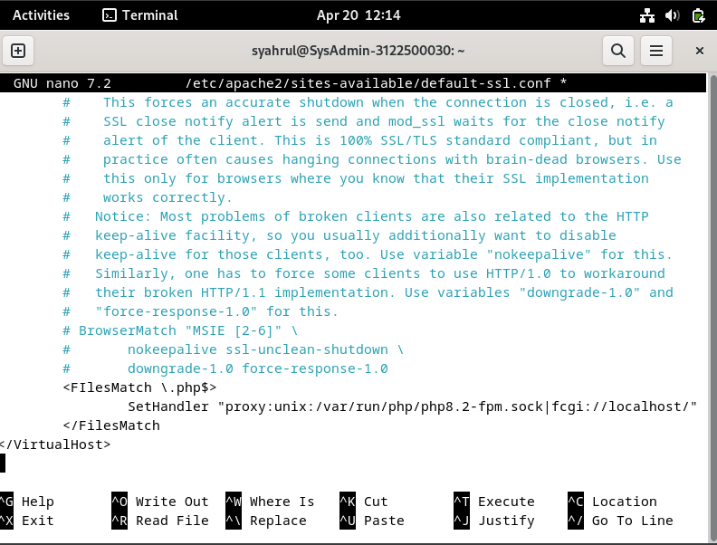


Jalankan command dibawah

`a2enmod proxy_fcgi` setenvif Ini berfungsi untuk mengaktifkan modul proxy_fcgi dan setenvif `a2enconf php8.2-fpm` Ini berfungsi untuk mengaktifkan konfigurasi php8.2-fpm `systemctl restart php8.2-fpm apache2` Ini berfungsi untuk merestart php8.2-fpm dan apache2

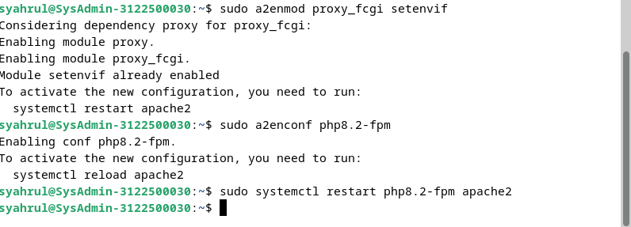

# KONFIGURASI DATABASE SERVER 

`sudo apt -y install mariadb-server` untuk menginstall mariadb


Isikan konfigurasi inisial seperti berikut:

    Enter current password for root (enter for none): Just press the Enter : (isi password root)
    Switch to unix_socket authentication [Y/n] : n
    Remove anonymous users? [Y/n] : Y
    Disallow root login remotely? [Y/n] : Y
    Remove test database and access to it? [Y/n] : Y
    Reload privilege tables now? [Y/n] : Y


Masuk ke database command `sudo mysql -u root -p`


Test database dengan command `show grants for 'root'@'localhost';`


tampilkan user,host dan password dari db mysql dan tabel user `select user,host,password from mysql.user;`


Tampilkan database yang ada pada MariaDB dengan command `show databases;`


buat database baru `create database siswa;`
lalu `use siswa;` lalu buat table dengan berikut
`create table siswa.siswa_table (nrp int, name varchar(50), address varchar(50), primary key (id));`


Isi value table dengan command `insert into siswa_table values(1, 'budi gaming', 'mongolia'); `


Cek database apakah sudah terinsert atau belum `select * from siswa_table;`


# INSTALL PHPMYADMIN 

Install phpmyadmin dengan command `sudo apt -y install phpmyadmin` lalu pilih apache2


Pilih configure database for phpmyadmin dengan dbconfig-common yes


Masukan password root phpmyadmin disini saya menggunakan password `user123`


Isikan password konfirmasi `user123`


masuk pada `sudo nano /etc/apache2/apache2.conf` Tambahkan baris berikut pada file konfigurasi apache2 di bagian paling bawah
```
 Include /etc/phpmyadmin/apache.conf
```


Buka browser dan akses phpmyadmin dengan alamat http://kelompok4.local/phpmyadmin


Masukkan username dan password root mysql yang telah diatur sebelumnya contoh:

    username: phpmyadmin
    password: user123


login ke mysql mysql -u root -p
tambahkan privilege user phpmyadmin dan password ganti dengan `user123` sesuai dengan yang kita setup tadi

    GRANT ALL PRIVILEGES ON *.* TO 'phpmyadmin'@'localhost' IDENTIFIED BY 'password' WITH GRANT OPTION;
    FLUSH PRIVILEGES;


Maka hasil ketika memberikan privileges root ke user phpmyadmin


# MAIL SERVER 

install postfix dengan command `apt -y install postfix sasl2-bin`


Pilih No configuration


Copas file main.cf ke direktori lain seperti berikut `cp /usr/share/postfix/main.cf.dist /etc/postfix/main.cf`


Edit file dengan vscode pastikan sudah terinstall agar bisa berjalan. Berikut commandnya
`code /etc/postfix/main.cf` lalu isi dengan konfigurasi klik
[disini](https://pastelink.net/0o7rolcy)
Setelah itu perbarui databases aliases postfix dengan command `sudo newaliases` setelah itu restart postfix `sudo systemctl restart postfix`


buka file main.cf code /etc/postfix/main.cf
tambahkan baris berikut di paling bawah

    # reject unknown clients that forward lookup and reverse lookup of their hostnames on DNS do not match
    smtpd_client_restrictions = permit_mynetworks, reject_unknown_client_hostname, permit

    # rejects senders that domain name set in FROM are not registered in DNS or
    # not registered with FQDN
    smtpd_sender_restrictions = permit_mynetworks, reject_unknown_sender_domain,reject_non_fqdn_sender

    # reject hosts that domain name set in FROM are not registered in DNS or
    # not registered with FQDN when your SMTP server receives HELO command
    smtpd_helo_restrictions = permit_mynetworks, reject_unknown_hostname,reject_non_fqdn_hostname, reject_invalid_hostname, permit

Lalu restart lagi postfix  `sudo systemctl restart postfix`

Install dovecot dengan command `sudo apt -y install dovecot-core dovecot-pop3d dovecot-imapd`


Edit file /etc/dovecot/dovecot.conf `sudo nano /etc/dovecot/ dovecot.conf`uncomment baris 30


Edit file /etc/dovecot/conf.d/10-auth.conf `sudo nano /etc/dovecot/conf.d/10-auth.conf` uncomment baris 10 dan setting ke no
ubah di baris 100 menjadi `disable_plaintext_auth = plain login`


Edit file /etc/dovecot/conf.d/10-mail.conf `sudo nano /etc/dovecot/conf.d/10-mail.conf` uncomment baris 30 dan ubah menjadi `mail_location = maildir:~/Maildir`


Edit file /etc/dovecot/conf.d/10-master.conf `sudo nano /etc/dovecot/conf.d/10-master.con`f uncomment baris 107-109 dan ubah seperti berikut

    unix_listener /var/spool/postfix/private/auth {
        mode = 0666
        user = postfix
        group = postfix
    }


Setelah itu jangan lupa install net-tools agar bisa menjalankan netstat dan juga restart dovecot dengan perintah `systemctl restart dovecot`


Periksa dengan perintah `netstat -a| grep LISTEN` lalu lihat pada port berapa postfix berjalan lalu jalankan perintah `telnet mail.kelompok4.local (port)`


Install thunderbird dengan perintah `sudo apt install thunderbird`


Login dengan user debian12 dengan mail local `syahrul@kelompok4.local` dengan password `user123`


Coba buat user baru dengan `sudo useradd` lalu login setelah itu kirim pesan ke user baru tersebut 


# Roundcube 

Masuk ke` MySQL mysql -u root -p` setelah itu 
Buat Database `CREATE DATABASE roundcubemail;` lalu
Buat User `CREATE USER 'roundcube'@'localhost' IDENTIFIED BY 'password';`


Berikan Hak Akses dengan command `grant all privileges on roundcube.* to roundcube@'localhost' identified by 'password'; `


Install roundcube dengan command `sudo apt-get install -y roundcube roundcube-mysql` dan pilih no karena database sudah kita buat sebelumnya


Masuk ke direktori konfigurasi `cd /usr/share/dbconfig-common/data/roundcube/install/`
import database `mysql -u roundcube -D roundcube -p < mysql `kemudian masukkan password yang telah dibuat sebelumnya
Konfigurasi database sudo nano /etc/roundcube/debian-db.php


Lalu sesuaikan dengan konfigurasi database sebelumnya


Konfigurasi Roundcube sudo nano /etc/roundcube/config.inc.php

- ubah line 27  $config['imap_host'] = ["tls://mail.kelompok3.local:143"];
- ubah line 31 $config['smtp_host'] = 'tls://mail.kelompok3.local:587';
- ubah line 39 $config['smtp_pass'] = '%p';
- ubah line 46 $config['product_name'] = 'Server Mail PENS';

tambah pada baris paling akhir:

        $config['smtp_auth_type'] = 'LOGIN';
        // specify SMTP HELO host
        $config['smtp_helo_host'] = 'mail.kelompok3.local';
        // specify domain name
        $config['mail_domain'] = 'mail.kelompok3.local';

        // specify UserAgent
        $config['useragent'] = 'Server World Webmail';
        // specify SMTP and IMAP connection option
        $config['imap_conn_options'] = array(
            'ssl'         => array(
                'verify_peer' => true,
                'CN_match' => 'kelompok3.local',
                'allow_self_signed' => true,
                'ciphers' => 'HIGH:!SSLv2:!SSLv3',
            ),
        );
        $config['smtp_conn_options'] = array(
        'ssl'   => array(
                'verify_peer' => true,
                'CN_match' => 'kelompok3.local',
                'allow_self_signed' => true,
                'ciphers' => 'HIGH:!SSLv2:!SSLv3',
            ),
        );


Setelah itu lanjut ke `sudo nano etc/apache2/sites-available/000-default.conf` tambahkan konfigurasi `Servername mail.kelompok4.local `dan `DocumentRoot /var/www/html`


# PRAKTIKUM MENGUNAKAN WEBMAIL DALAM 1 JARINGAN

## SETUP AWAL

Pertama-tama sambungkan komputer dengan kabel ethernet lokal yang tersedia. Setelah tersambung dengan jaringan lokal pastikan IP sesuai dengan kelompok/meja gunakan command `ipconfig/all` pada kasus ini saya mendapatkan IP `192.168.4.1` karena saya merupakan kelompok 4


Lalu ubah pada setting network pada virtual machine ke Bridged Adapter dan ganti adapter sesuai dengan hasil command `ipconfig/all` yaitu `Realtek PCIe GbE Family Controller`


## SETUP DEBIAN 12

Jalankan VM anda lalu pergi ke `sudo nano /etc/bind/named.conf.options`


Rubah konfigurasi forwarders dengan `10.10.10.1` dan `192.168.4.10` ganti IP listen on ke `192.168.4.10` terakhir ganti konfigurasi `allow-query` dan `allow-recursion `ke `any`. Konfigurasinya akan menjadi seperti berikut:


Rubah juga konfigurasi di `sudo nano /etc/resolv.conf` tambahkan `nameserver 192.168.4.10` seperti dibawah berikut:


Setelah itu coba tes ping IP kelompok lain yaitu kelompok 2 dengan command `ping 192.168.2.10` jika konfigurasi network benar maka maka hasilnya akan seperti berikut:


Coba juga tes ping ke sebagai contoh `detik.com` dengan command `ping detik.com` jika konfigurasi network benar maka akan seperti dibawah ini:


Buka browser dan coba test apakah bisa mengakses webmail (roundcube) kelompok lain disini saya mencoba mengakses ke webmail kelompok 2 dengan alamat `mail.kelompok2.local` Jika berhasil maka akan tampil seperti berikut:


Buka browser dan coba test apakah bisa mengakses webmail (roundcube) dengan alamat `mail.kelompok4.local/roundcube` Jika berhasil maka akan tampil seperti berikut:


Jika network static tidak bekerja dan tidak bisa tampil seperti diatas maka coba buka `sudo nano /etc/network/interfaces` buat auto network dengan mengcomment konfigurasi static pada seperti dibawah ini:


Lalu setup manual IPv4 dengan IP addres `192.168.4.10` netmask `255.255.255.0` gateway `192.168.4.1` dan DNS `10.10.10.1`


## KONFIGURASI WINBOX

Buka winbox di windows lalu pergi ke menu bridge. Setelah itu remove bridge yang ada dan buat baru. langsung next next saja hingga bertemu setting DNS inputkan `10.10.10.1`


## HASIL AKHIR

Login ke rouncube dengan user dan password yang sudah disetup. pada kasus ini saya bisa menerima pesan dari user `iqbal@kelompok6.local` seperti pada gambar dibawah ini:


Disini saya ingin mencoba mengirim pesan email ke `user@kelompok2.local` dan berhasil


# TELNET

Pertama tama masuk ke Terminal lalu ketikan command ``telnet 192.168.4.10 25`` atau ``telnet mail.kelompok4.local`` setelah itu masukan command ``ehlo kelompok4.local`` seperti dibawah berikut:


Ketikan dengan format email:

    MAIL FROM: <alamat email anda>
    RCPT TO: <tujuan alamat email anda>

Setelah itu tekan enter untuk mendapatkan pesan ``250 2.1.5 Ok``
Lalu Masukan:
        
    DATA

Tekan enter dan masukan isi email dengan format:

    From: <nama pengirim>
    To: <tujuan pengirim>
    Date: <Tanggal pengiriman>
    Subject: <subject pesan>

Setelah menekan enter masukan pesan anda jika selesai tekan ``ctrl+c`` maka pesan terkirim
      


# Header MIME Analysis

Analysis Header Text mail Roundcube


1. **Return-Path**: Menunjukkan alamat email tempat bounce atau kegagalan pengiriman akan dikirimkan. Di sini, diatur ke user@mail.kelompok2.local.

2. **X-Original-To**: Menunjukkan penerima asli email sebelum ada proses penerusan atau pemrosesan daftar mailing. Di sini, menunjukkan syahrul@mail.kelompok4.local.

3. **Delivered-To**: Menunjukkan alamat email di mana email akhirnya dikirimkan. Cocok dengan bidang X-Original-To, yaitu syahrul@mail.kelompok4.local.

4. **Received**: Menunjukkan jalur yang ditempuh email untuk mencapai kotak surat penerima. Ada dua header Received dalam gambar ini:

    - Yang pertama menunjukkan bahwa email berasal dari mail.kelompok2.local dengan alamat IP 192.168.88.2. Ini menunjukkan bahwa email dikirim secara internal dalam jaringan lokal.
    - Yang kedua menunjukkan bahwa email diterima oleh mail.kelompok4.local pada tanggal 29 April 2024, pukul 13.52 WIB.

5. **MIME-Version**: Menentukan versi standar Multipurpose Internet Mail Extensions (MIME) yang digunakan dalam email. Di sini, diatur ke 1.0.

6. **Date**: Menunjukkan tanggal dan waktu email dikirim. Cocok dengan penanda waktu di header Received kedua, yaitu 29 April 2024, pukul 13.52 WIB.

7. **From**: Menunjukkan pengirim email. Menunjukkan "user" <user@mail.kelompok2.local>, yang berarti email dikirim oleh pengguna bernama "user" dengan alamat email user@mail.kelompok2.local.

8. **To**: Menentukan penerima email. Menunjukkan "syahrul" <syahrul@mail.kelompok4.local>, yang menunjukkan bahwa email dikirim kepada seseorang bernama "syahrul" dengan alamat email syahrul@mail.kelompok4.local.

9. **Subject**: Mengandung baris subjek email, yaitu "Re: hendro". Ini menunjukkan bahwa email ini merupakan balasan terhadap email dengan subjek "hendro".

10. **In-Reply-To**: Referensi pesan ID email yang email ini membalasnya. Nilainya adalah <755af16635ec65bc45d036c4463e6017@mail.kelompok4.local>.

11. **References**: Header ini digunakan untuk menentukan email terkait, seperti email sebelumnya dalam sebuah percakapan. Di sini, merujuk pada ID pesan yang sama dengan header In-Reply-To, menunjukkan bahwa email ini merupakan bagian dari percakapan tentang email dengan ID <755af16635ec65bc45d036c4463e6017@mail.kelompok4.local>.

12. **Message-ID**: Unik mengidentifikasi pesan email. Ini adalah <5e1fbf0b82b1f15a1d72fbdedbde1203@mail.kelompok2.local>.

13. **X-Sender**: Header ini tidak merupakan bagian dari format email standar tetapi mungkin digunakan oleh beberapa server email untuk menentukan alamat email pengirim. Di sini, cocok dengan bidang Dari, diatur ke user@mail.kelompok2.local.

14. **Content-Type**: Menentukan format konten email. Di sini, diatur ke text/plain; charset=US-ASCII; format=flowed, menunjukkan bahwa isi email adalah teks biasa yang dienkripsi dalam set karakter US-ASCII dan diformat untuk tampilan teks yang dapat mengalir.

15. **Content-Transfer-Encoding**: Menentukan encoding yang digunakan untuk konten email. Di sini, diatur ke 7bit, menunjukkan bahwa teks dienkripsi menggunakan set karakter 7-bit, yang cocok untuk sebagian besar karakter umum.


Analysis Header Image mail Roundcube


1. **Message-ID**: Header ini memberikan pengenal unik untuk email tersebut. ID pesan dari email ini adalah <fe3c089ae91ca1f2ef11d64d15d577ad@mail.kelompok4.local>.

2. **Date**: Header ini menunjukkan tanggal dan waktu email dikirim. Email ini dikirim pada hari Senin, 22 April 2024, pukul 19.00 WIB.

3. **From**: Header ini menunjukkan pengirim email. Bidang Dari menunjukkan "syahrul" dengan alamat email syahrul@mail.kelompok4.local.

4. **To**: Header ini menentukan penerima email. Dalam kasus ini, ada dua penerima:

    - "User1" dengan alamat email user1@mail.kelompok3.local
    - "Akmal" dengan alamat email akmal@mail.kelompok1.local

5. **Subject**: Header ini berisi baris subjek email, yaitu "test".

6. **User-Agent**: Header ini menentukan perangkat lunak atau klien email yang digunakan untuk mengirim email. Di sini, User-Agent adalah "Server World Webmail".

7. **MIME-Version**: Header ini menentukan versi MIME yang digunakan dalam email. Di sini, digunakan versi MIME 1.0.

8. **Content-Type**: Header ini menentukan format konten email. Jenis konten adalah multipart/alternative; boundary="_6d764f06894e82d98047f7858e7363dd", yang menunjukkan email multipart yang berisi bagian-bagian alternatif. String batas spesifik memisahkan bagian-bagian ini.

