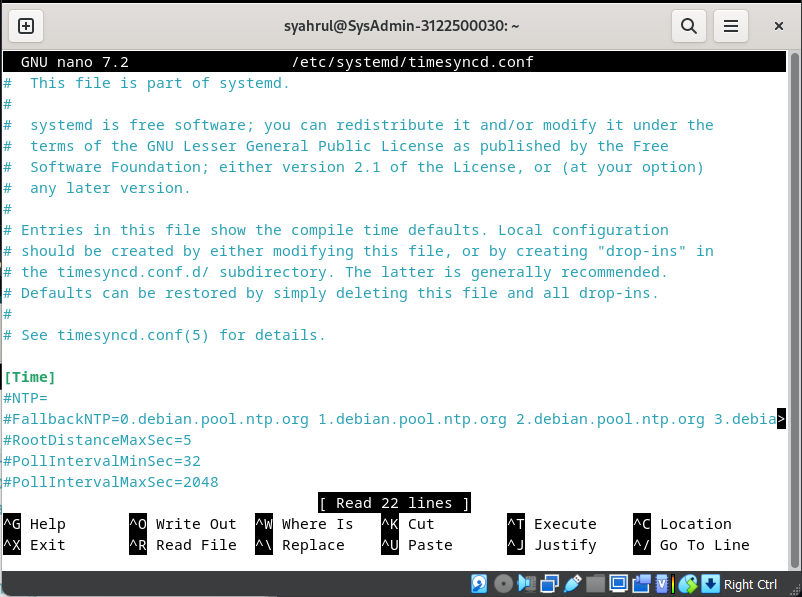
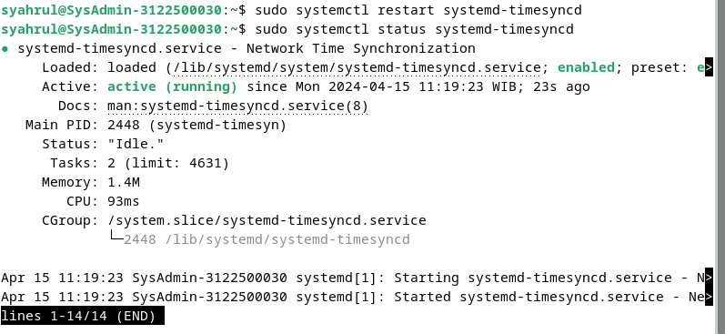
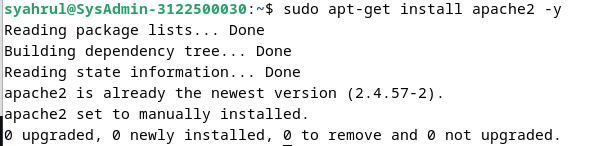
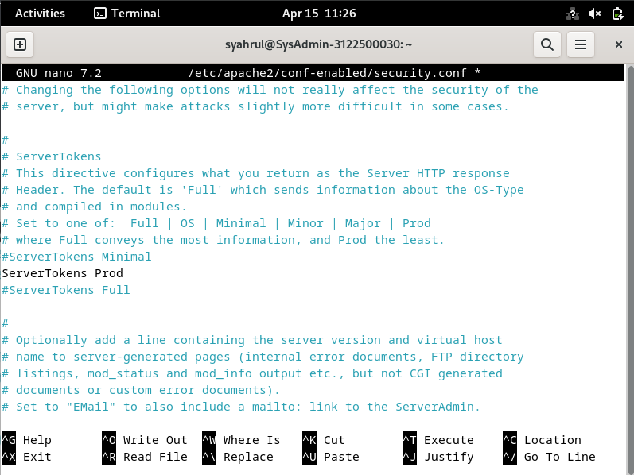
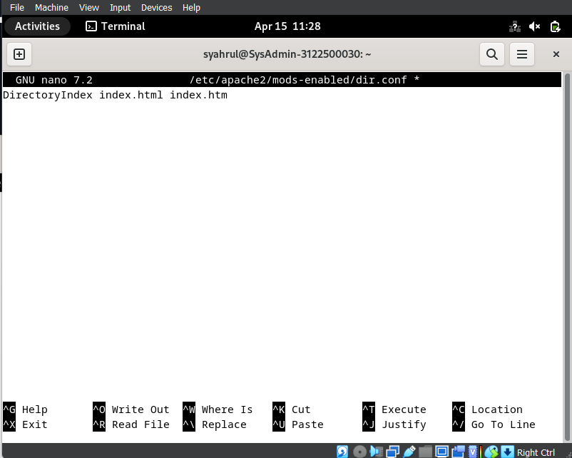
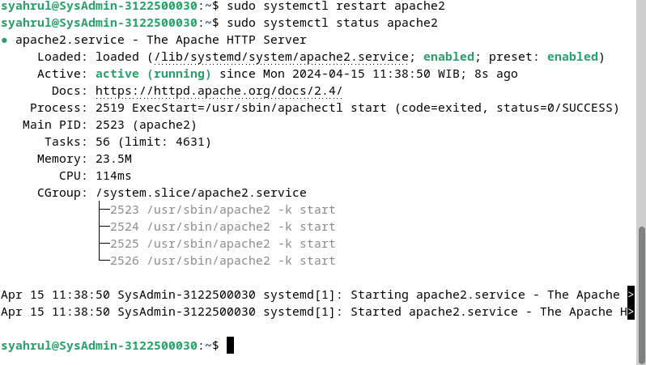
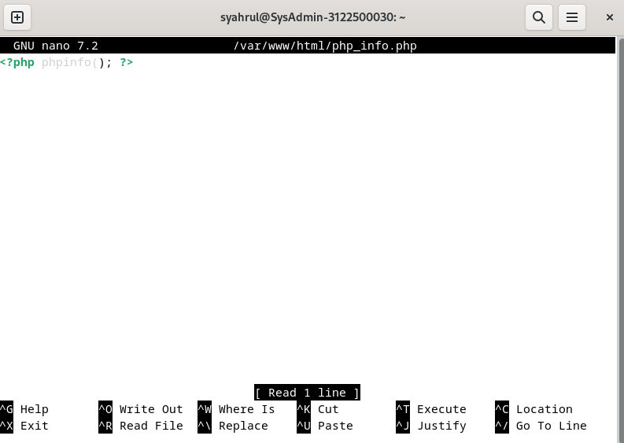

<h1 align="center">
LAPORAN PRAKTIKUM WORKSHOP

**ADMINISTRASI JARINGAN**

</h1>
<p align="center">
“WEB EMAIL SYSTEM SERVER”
</p>

<p align="center">
    
</p>

<h4 align="center">

Disusun Oleh:

**Gede Hari Yoga Nanda  					3122500005**

**Handaru Dwiki Yuntara     				3122500017**

**Muhammad Syahrul Ramadhan				3122500030**

</h4>

<h3 align="center">

2 D3 INFORMATIKA A

DEPARTEMEN TEKNIK INFORMATIKA DAN KOMPUTER JURUSAN TEKNIK INFORMATIKA
POLITEKNIK ELEKTRONIKA NEGERI SURABAYA

2023/2024

</h3>


# INSTALASI NTP

gunakan command `sudo apt-get install systemd-timesyncd` menginstall package timesyncd


gunakan command `sudo timedatectl set-timezone Asia/Jakarta` untuk set waktu WIB (Jakarta)


gunakan command `sudo timedatectl set-ntp true` untuk menjalankan NTP pada package


`sudo nano /etc/systemd/timesyncd.conf`uncomment ubah bagian`NTP=` 


Isi bagian NTP menjadi: `NTP=0.id.pool.ntp.org `


`sudo systemctl restart systemd-timesyncd` untuk merestart services karena habis di setup lalu cek status dengan command `sudo systemctl status systemd-timesyncd`


Cek apakah sudah sesuai dengan timezone WIB


# INSTALASI WEB SERVER

Instal apache2 dengan command `sudo apt-get install apache2 -y`


ketikan command `sudo nano /etc/apache2/conf-enabled/security.conf` rubah pada bagian ServerTokens menjadi Prod


ketika command `sudo nano /etc/apache2/mods-enabled/dir.conf`
Ubah bagian DirectoryIndex menjadi index.html index.htm



ketikan command `sudo nano /etc/apache2/apache2.conf` Tambahkan ServerName www.kelompok4.local


Ketikkan command `sudo nano /etc/apache2/sites-available/000-default.conf`Ubah bagian webmaster@localhost menjadi webmaster@kelompok4.local


Restart services apache 2 dengan command `sudo systemctl restart apache2` lalu cek status services apache2 `sudo systemctl status apache2`


Buka browser dan ketikkan alamat `www.kelompok4.local` untuk mengecek


install PHP dan fungsi mbstring digunakan untuk memanipulasi string atau text non ASCII `sudo apt -y install php8.2 php8.2-mbstring php-pear` lalu cek versi dengan command `php-v`

buat file `php_info.php` di /var/www/html `sudo nano /var/www/html/php_info.php` isi file php_info.php dengan kode berikut `<?php phpinfo(); ?>`


install PHP FPM 


ketikan command`sudo nano /etc/apache2/sites-available/default-ssl.conf` ini berfungsi untuk mengarahkan apache2 ke php-fpm tambahkan di dalam tag `<VirtualHost *:443></VirtualHost>`
  ```
    <FilesMatch \.php$>
        SetHandler "proxy:unix:/var/run/php/php8.2-fpm.sock|fcgi://localhost/"
    </FilesMatch>    
```


Jalankan command dibawah

`a2enmod proxy_fcgi` setenvif Ini berfungsi untuk mengaktifkan modul proxy_fcgi dan setenvif `a2enconf php8.2-fpm` Ini berfungsi untuk mengaktifkan konfigurasi php8.2-fpm `systemctl restart php8.2-fpm apache2` Ini berfungsi untuk merestart php8.2-fpm dan apache2


# KONFIGURASI DATABASE SERVER 

`sudo apt -y install mariadb-server` untuk menginstall mariadb


Isikan konfigurasi inisial seperti berikut:

    Enter current password for root (enter for none): Just press the Enter : (isi password root)
    Switch to unix_socket authentication [Y/n] : n
    Remove anonymous users? [Y/n] : Y
    Disallow root login remotely? [Y/n] : Y
    Remove test database and access to it? [Y/n] : Y
    Reload privilege tables now? [Y/n] : Y


masuk ke database command `sudo mysql -u root -p`


Test database dengan command `show grants for 'root'@'localhost';`


tampilkan user,host dan password dari db mysql dan tabel user `select user,host,password from mysql.user;`


Tampilkan database yang ada pada MariaDB dengan command `show databases;`


buat database baru `create database siswa;`
lalu `use siswa;` lalu buat table dengan berikut
`create table siswa.siswa_table (nrp int, name varchar(50), address varchar(50), primary key (id));`


Isi value table dengan command `insert into siswa_table values(1, 'budi gaming', 'mongolia'); `


Cek database apakah sudah terinsert atau belum `select * from siswa_table;`


# INSTALL PHPMYADMIN 

Install phpmyadmin dengan command `sudo apt -y install phpmyadmin` lalu pilih apache2


Pilih configure database for phpmyadmin dengan dbconfig-common yes


Masukan password root phpmyadmin disini saya menggunakan password `user123`


Isikan password konfirmasi `user123`


masuk pada `sudo nano /etc/apache2/apache2.conf` Tambahkan baris berikut pada file konfigurasi apache2 di bagian paling bawah
```
 Include /etc/phpmyadmin/apache.conf
```


Buka browser dan akses phpmyadmin dengan alamat http://kelompok4.local/phpmyadmin


Masukkan username dan password root mysql yang telah diatur sebelumnya contoh:

    username: phpmyadmin
    password: user123


login ke mysql mysql -u root -p
tambahkan privilege user phpmyadmin dan password ganti dengan `user123` sesuai dengan yang kita setup tadi

    GRANT ALL PRIVILEGES ON *.* TO 'phpmyadmin'@'localhost' IDENTIFIED BY 'password' WITH GRANT OPTION;
    FLUSH PRIVILEGES;


Maka hasil ketika memberikan privileges root ke user phpmyadmin


# MAIL SERVER 

install postfix dengan command `apt -y install postfix sasl2-bin`


Pilih No configuration


Copas file main.cf ke direktori lain seperti berikut `cp /usr/share/postfix/main.cf.dist /etc/postfix/main.cf`


Edit file dengan vscode pastikan sudah terinstall agar bisa berjalan. Berikut commandnya
`code /etc/postfix/main.cf` lalu isi dengan konfigurasi klik
[disini](https://pastelink.net/0o7rolcy)

Setelah itu perbarui databases aliases postfix dengan command `sudo newaliases` setelah itu restart postfix `sudo systemctl restart postfix`


buka file main.cf code /etc/postfix/main.cf
tambahkan baris berikut di paling bawah

    # reject unknown clients that forward lookup and reverse lookup of their hostnames on DNS do not match
    smtpd_client_restrictions = permit_mynetworks, reject_unknown_client_hostname, permit

    # rejects senders that domain name set in FROM are not registered in DNS or
    # not registered with FQDN
    smtpd_sender_restrictions = permit_mynetworks, reject_unknown_sender_domain,reject_non_fqdn_sender

    # reject hosts that domain name set in FROM are not registered in DNS or
    # not registered with FQDN when your SMTP server receives HELO command
    smtpd_helo_restrictions = permit_mynetworks, reject_unknown_hostname,reject_non_fqdn_hostname, reject_invalid_hostname, permit

Lalu restart lagi postfix  `sudo systemctl restart postfix`

Install dovecot dengan command `sudo apt -y install dovecot-core dovecot-pop3d dovecot-imapd`


Edit file /etc/dovecot/dovecot.conf `sudo nano /etc/dovecot/ dovecot.conf`uncomment baris 30


Edit file /etc/dovecot/conf.d/10-auth.conf `sudo nano /etc/dovecot/conf.d/10-auth.conf` uncomment baris 10 dan setting ke no
ubah di baris 100 menjadi `disable_plaintext_auth = plain login`


Edit file /etc/dovecot/conf.d/10-mail.conf `sudo nano /etc/dovecot/conf.d/10-mail.conf` uncomment baris 30 dan ubah menjadi `mail_location = maildir:~/Maildir`


Edit file /etc/dovecot/conf.d/10-master.conf `sudo nano /etc/dovecot/conf.d/10-master.con`f uncomment baris 107-109 dan ubah seperti berikut

    unix_listener /var/spool/postfix/private/auth {
        mode = 0666
        user = postfix
        group = postfix
    }


Setelah itu jangan lupa install net-tools agar bisa menjalankan netstat dan juga restart dovecot dengan perintah `systemctl restart dovecot`


Periksa dengan perintah `netstat -a| grep LISTEN` lalu lihat pada port berapa postfix berjalan lalu jalankan perintah `telnet mail.kelompok4.local (port)`


Install thunderbird dengan perintah `sudo apt install thunderbird`


Login dengan user debian12 dengan mail local `syahrul@kelompok4.local` dengan password `user123`


Coba buat user baru dengan `sudo useradd` lalu login setelah itu kirim pesan ke user baru tersebut 


# Roundcube 

Masuk ke` MySQL mysql -u root -p` setelah itu 
Buat Database `CREATE DATABASE roundcubemail;` lalu
Buat User `CREATE USER 'roundcube'@'localhost' IDENTIFIED BY 'password';`


Berikan Hak Akses dengan command `grant all privileges on roundcube.* to roundcube@'localhost' identified by 'password'; `


Install roundcube dengan command `sudo apt-get install -y roundcube roundcube-mysql` dan pilih no karena database sudah kita buat sebelumnya


Masuk ke direktori konfigurasi `cd /usr/share/dbconfig-common/data/roundcube/install/`
import database `mysql -u roundcube -D roundcube -p < mysql `kemudian masukkan password yang telah dibuat sebelumnya
Konfigurasi database sudo nano /etc/roundcube/debian-db.php


Lalu sesuaikan dengan konfigurasi database sebelumnya


Konfigurasi Roundcube sudo nano /etc/roundcube/config.inc.php

- ubah line 27  $config['imap_host'] = ["tls://mail.kelompok3.local:143"];
- ubah line 31 $config['smtp_host'] = 'tls://mail.kelompok3.local:587';
- ubah line 39 $config['smtp_pass'] = '%p';
- ubah line 46 $config['product_name'] = 'Server Mail PENS';

tambah pada baris paling akhir:

        $config['smtp_auth_type'] = 'LOGIN';
        // specify SMTP HELO host
        $config['smtp_helo_host'] = 'mail.kelompok3.local';
        // specify domain name
        $config['mail_domain'] = 'mail.kelompok3.local';

        // specify UserAgent
        $config['useragent'] = 'Server World Webmail';
        // specify SMTP and IMAP connection option
        $config['imap_conn_options'] = array(
            'ssl'         => array(
                'verify_peer' => true,
                'CN_match' => 'kelompok3.local',
                'allow_self_signed' => true,
                'ciphers' => 'HIGH:!SSLv2:!SSLv3',
            ),
        );
        $config['smtp_conn_options'] = array(
        'ssl'   => array(
                'verify_peer' => true,
                'CN_match' => 'kelompok3.local',
                'allow_self_signed' => true,
                'ciphers' => 'HIGH:!SSLv2:!SSLv3',
            ),
        );


Setelah itu lanjut ke `sudo nano etc/apache2/sites-available/000-default.conf` tambahkan konfigurasi `Servername mail.kelompok4.local `dan `DocumentRoot /var/www/html`
